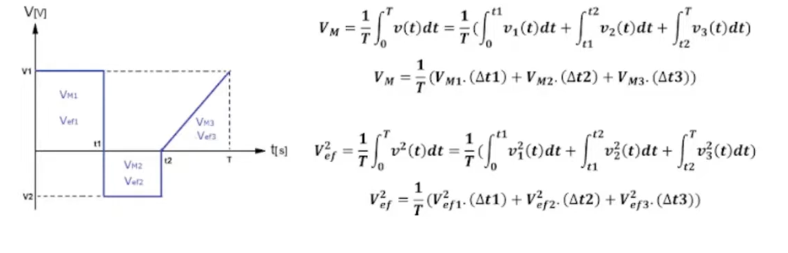

***Valor Medio*** 

$$ Vm = \frac{1}{T}\int_{0}^{T}V(t)dt \quad \quad Im = \frac1T \int_{0}^{T} i(t)dt $$

***Valor Eficaz*** 

$$ Vef=\sqrt{\frac1T\int_{0}^{T}V^2(t)dt} \quad <=> \quad Vef^2=\frac1T\int_{0}^{T}V^2(t)dt $$
$$ Ief = \sqrt{\frac1T\int_{0}^{T}i^2(t)dt} \quad <=> \quad Ief^2 = \frac1T \int_{0}^{T}i^2(t)dt $$
