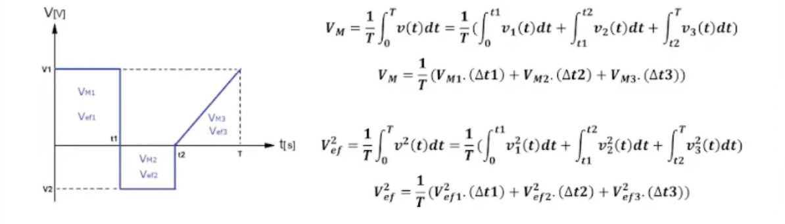

***Valor Medio*** 

$$ Vm = \frac{1}{T}\int_{0}^{T}V(t)dt \quad \quad Im = \frac1T \int_{0}^{T} i(t)dt $$

***Valor Eficaz*** 

$$ Vef=\sqrt{\frac1T\int_{0}^{T}V^2(t)dt} \quad <=> \quad Vef^2=\frac1T\int_{0}^{T}V^2(t)dt $$
$$ Ief = \sqrt{\frac1T\int_{0}^{T}i^2(t)dt} \quad <=> \quad Ief^2 = \frac1T \int_{0}^{T}i^2(t)dt $$

Ecuación integral dividida por tramos:
$$V_M = \frac{1}{T} \int_{0}^{T} v(t) dt = \frac{1}{T} \left( \int_{0}^{t1} v_1(t) dt + \int_{t1}^{t2} v_2(t) dt + \int_{t2}^{T} v_3(t) dt \right)$$

Ecuación simplificada por intervalos de tiempo:
$$V_M = \frac{1}{T} (V_{M1} \cdot (\Delta t1) + V_{M2} \cdot (\Delta t2) + V_{M3} \cdot (\Delta t3))$$

Ecuación integral dividida por tramos:
$$V_{ef}^2 = \frac{1}{T} \int_{0}^{T} v^2(t) dt = \frac{1}{T} \left( \int_{0}^{t1} v_1^2(t) dt + \int_{t1}^{t2} v_2^2(t) dt + \int_{t2}^{T} v_3^2(t) dt \right)$$

Ecuación simplificada por intervalos de tiempo:
$$V_{ef}^2 = \frac{1}{T} (V_{ef1}^2 \cdot (\Delta t1) + V_{ef2}^2 \cdot (\Delta t2) + V_{ef3}^2 \cdot (\Delta t3))$$

